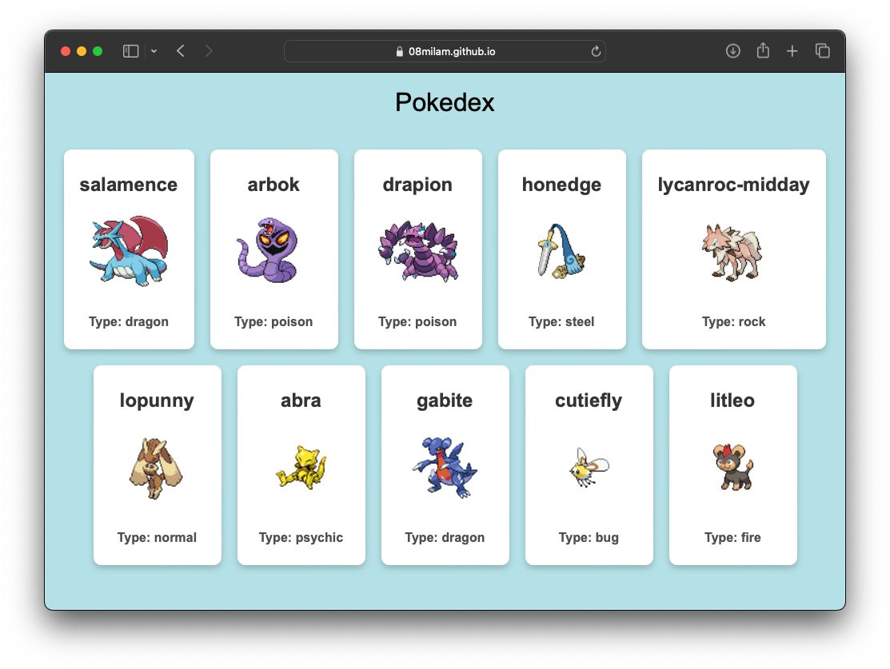

Experience the thrill of encountering random Pokémon with the Pokémon Encounter app! Powered by React.js, CSS, JavaScript, and HTML, this web application brings the world of Pokémon to your screen. Each time you refresh the page, you'll discover 10 random Pokémon fetched from an API, ensuring every visit is a new adventure. Dive into nostalgia, explore different Pokémon species, and embark on a journey to catch 'em all!

HOW TO RUN 
------------------------------------
* To get started, navigate to the Pokemon repository on GitHub and download the files. Then, open the folder in Visual Studio Code and launch the live server extension. This action  will automatically open the project in your default web browser.

TECHNOLOGY STACK USED
------------------------------------
* HTML
* CSS
* JavaScript
* reactDOM

